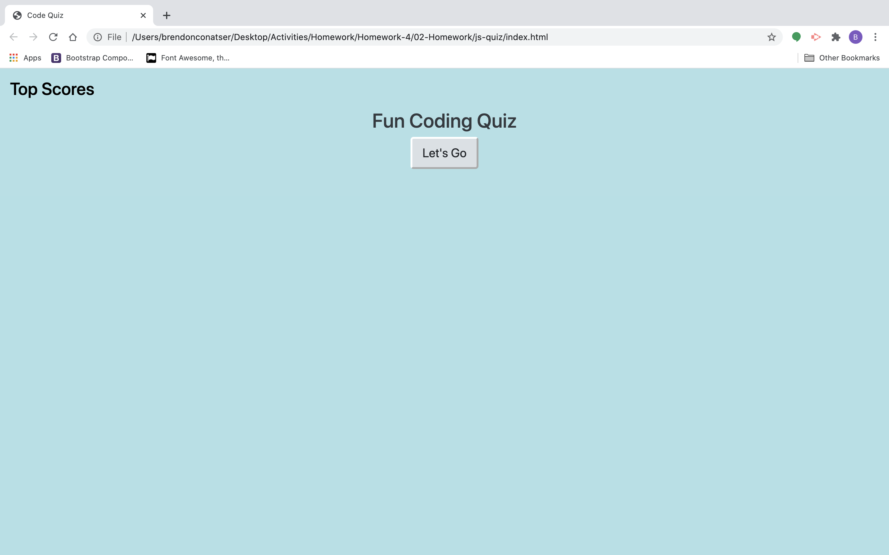
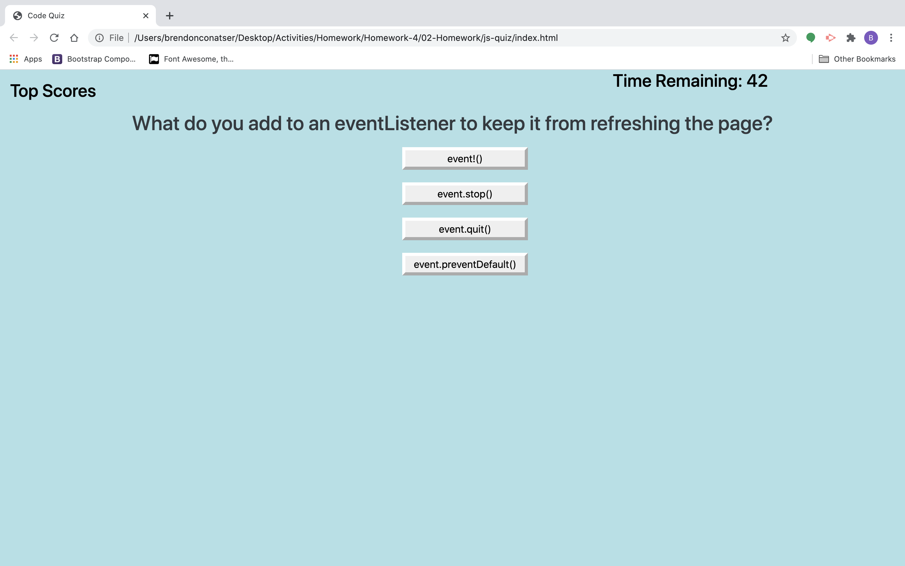
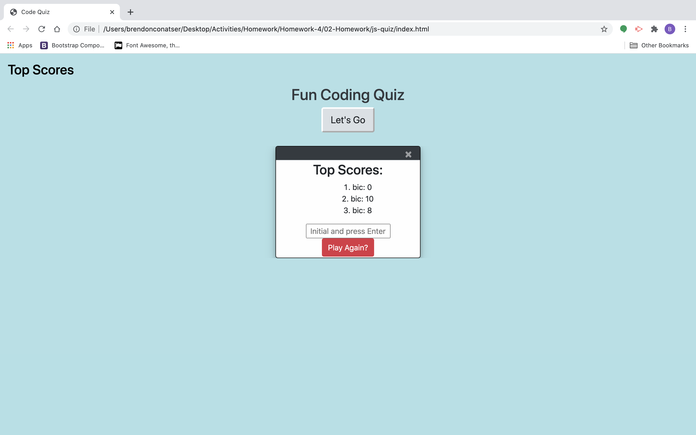

# Javascript Code Quiz

## Description
This was a homework assignment to build a Quiz using Javascript. 
I did have more trouble with this one than the last assignments 
but I learned a lot about JS and scope through this activity.

## Usage
To begin the quiz you click the start button. When you are finished 
with the quiz it will store your score and you can enter your initials 
and see yourself on the score board!

## Installation

repository- 
 
website-